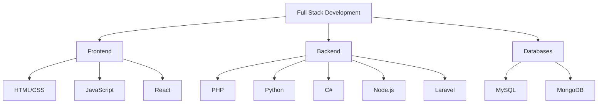

# 👨‍💻 Taqdees | Backend Developer

  
  

## 🚀 Tech Stack

### Frontend

### Backend

### Databases

## 💼 Professional Experience

### 🌐 Viola Network
Revolutionizing network solutions
- [Learn more](https://violanetwork.com)

### 🎥 VidPlo
Optimizing video streaming performance
- [Explore VidPlo](https://vidplo.violanetwork.com)

## 📊 Skill Distribution

## 💡 Let's Innovate Together!

I'm passionate about turning ideas into reality through code. Whether you're looking to build a groundbreaking app, optimize your backend, or discuss the latest tech trends, I'm here to collaborate!

  

Crafted with ❤️ and ☕ by Taqdees | © 2024

