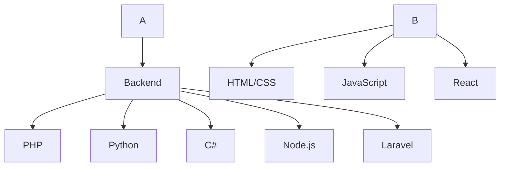

# 👨‍💻 Taqdees | Backend Developer

> Crafting digital experiences, one line of code at a time.

<p align="center">
  <a href="mailto:taqdees678@gmail.com"></a>
  <a href="https://github.com/TaqdeesHigh/"></a>
</p>

## 🚀 Tech Arsenal

<table>
  <tr>
    <td align="center" width="96">
      
      <br>HTML
    </td>
    <td align="center" width="96">
      
      <br>CSS
    </td>
    <td align="center" width="96">
      
      <br>JavaScript
    </td>
    <td align="center" width="96">
      
      <br>PHP
    </td>
    <td align="center" width="96">
      
      <br>Python
    </td>
    <td align="center" width="96">
      
      <br>C#
    </td>
  </tr>
  <tr>
    <td align="center" width="96">
      
      <br>React
    </td>
    <td align="center" width="96">
      
      <br>Node.js
    </td>
    <td align="center" width="96">
      
      <br>Laravel
    </td>
    <td align="center" width="96">
      
      <br>MySQL
    </td>
    <td align="center" width="96">
      
      <br>MongoDB
    </td>
  </tr>
</table>

## 💼 Professional Journey

<div align="center">
  
  
</div>

### 🌐 Viola Network
- [Learn more](https://violanetwork.com)

### 🎥 VidPlo
- Optimizing video streaming performance
- [Explore VidPlo](https://vidplo.violanetwork.com)

## 📊 Skill Breakdown



## 💡 Let's Collaborate!

I'm always excited to work on innovative projects and solve challenging problems. Whether you have a project idea, need technical advice, or just want to chat about the latest in tech, I'm all ears!

<div align="center">
  
</div>

<p align="center">Made with ❤️ and ☕ by Taqdees</p>
```
