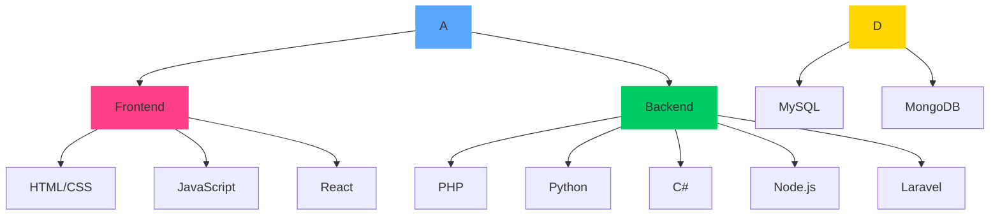

Certainly! I'll create a more unique and modern design for your profile. Here's a completely redesigned version that aims to be both visually striking and professional:

```markdown
<div align="center">
  
</div>

<p align="center">
  <em>Transforming ideas into digital gold, one line of code at a time</em>
</p>

<div align="center">
  <a href="mailto:taqdees678@gmail.com">
    
  </a>
  <a href="https://github.com/TaqdeesHigh/">
    
  </a>
</div>

<br />

<div align="center">
  
</div>

<br />

## 🧪 Tech Elixirs

<table align="center">
  <tr>
    <td align="center">
      
      <br>
      <strong>Frontend Brew</strong>
    </td>
    <td align="center">
      
      <br>
      <strong>Backend Potion</strong>
    </td>
  </tr>
  <tr>
    <td align="center" colspan="2">
      
      <br>
      <strong>Data Cauldron</strong>
    </td>
  </tr>
</table>

## 🔮 Magical Endeavors

<details>
<summary><strong>🌐 Viola Network</strong></summary>
<br>
Weaving digital tapestries that connect worlds
<br>
<a href="https://violanetwork.com">🔗 Explore the Magic</a>
</details>

<details>
<summary><strong>🎥 VidPlo</strong></summary>
<br>
Conjuring seamless streams in the digital realm
<br>
<a href="https://vidplo.violanetwork.com">🔗 Witness the Spectacle</a>
</details>

## 🧙‍♂️ Skill



## 💫 Summon Me for Collaboration!

Are you ready to embark on a digital odyssey? Whether you're scheming to craft the next revolutionary app, unravel complex backend enigmas, or simply engage in a riveting discourse on the arcane arts of technology, I'm your ally in this quest!

<div align="center">
  
</div>

<p align="center">
  
</p>

<p align="center">© 2024 Taqdees | All rights reserved</p>
