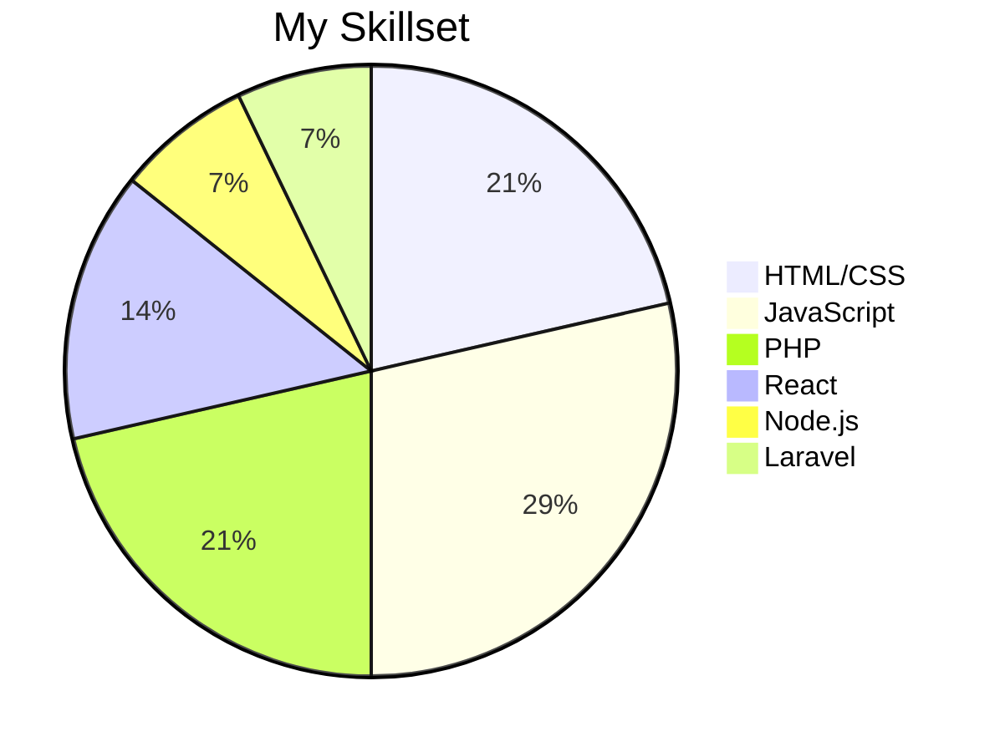

# Hi there 👋, I'm [Taqdees]!

I'm a **Backend** with a passion for creating robust and scalable applications. I enjoy working on both the front end and back end, ensuring seamless integration and optimal performance.

## 🛠️ Technologies & Tools

### Languages:
- 
- 
- 
- 
- 

### Frameworks & Libraries:
- 
- 
- 

### Databases:
- 
- 

## 📊 My Skills

## 🌟 Projects

Here are some of my favorite projects:
- Portfolion-Template: [Link](https://github.com/TaqdeesHigh/Portfolio)
- ChattingWeb-Template: [Link](https://github.com/TaqdeesHigh/ChattingWeb-Template)
- VideoCache: [Link](https://github.com/TaqdeesHigh/VideoCache)
- **I'm also working on some more open source projects**

## 📫 Get In Touch

Feel free to reach out if you want to collaborate on a project, need help with something, or just want to connect.

- 
- Discord: taqdees__

Thanks for visiting my profile! Looking forward to connecting with you!

